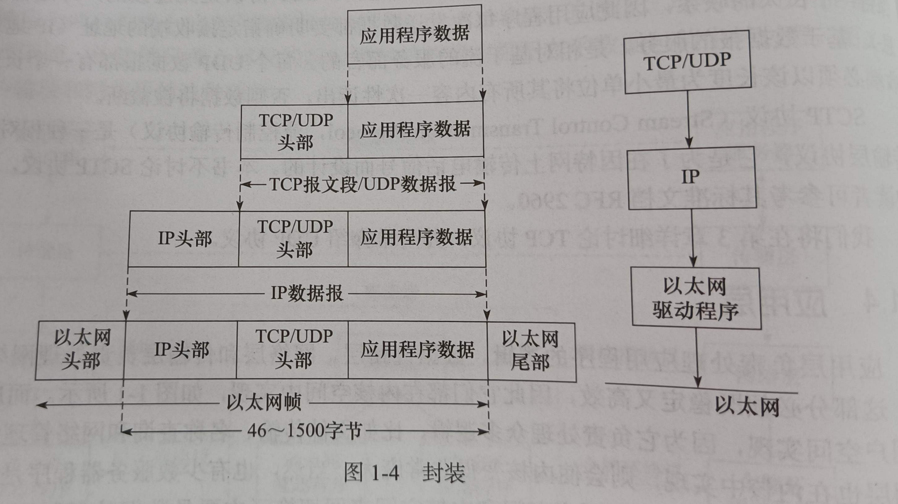
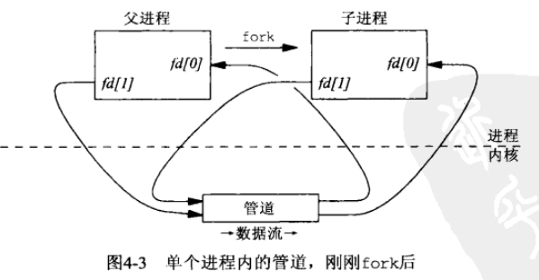

# chapter1~4

- 层层封装
  
- ICMP 报文格式
  
- 以太网帧

<hr>

- 抓包本地回路
  sudo tcpdump -ntx -i lo
- 登录本机
  telnet 127.0.0.1
- 抓取 ICMP 报文
  sudo tcpdump -ntv -i eth0 icmp

<hr>
## 关于IP
IP数据报通过路由表转发；
路由表可以手动更新，也可以采用BGP、RIP、OSPF等进行动态更新；
```C
//主机1的路由表增加主机2
$sudo route add -host 192.168.1.109 dev eth0;
//删除本地局域网路由表项(连通其他局域网内主机)和默认路由表项(上网)
$sudo route del -net 192.168.1.0 netmask 255.255.255.0
$sudo route del default
//将主机2作为主机1的网关，主机1通过主机2进行上网
$sudo route add default gw 192.168.1.109 dev eth0
```
在上述修改之后，主机1的路由表项一项是连接主机2，一项是默认表项(主机2作为网关)。
一般上网流程是，主机1发送一个IP数据报，如果目的IP在路由表项中(最长匹配)则相应转发；如果无匹配，则通过默认网关进行转发。所以主机1 ping 外部网站的时候，先转默认网关主机2，主机2转路由器，路由器转外部网站。
在这个过程中，因为转到主机2时还无法ping到外部网站，所以主机2此时会用icmp重定向报文返回一个合理的路由方式给主机1，即主机2的路由器ip，于是主机1的路由缓冲增加了主机2的路由器，以后主机1要是再想访问外部网站，就无须访问主机2(默认)，因为在那之前就在路由表项中得到了匹配。

<hr>
## 关于TCP
TCP相比UDP的特点：面向连接、字节流和可靠传输。
* 字节流:TCP存在发送缓冲区和接收缓冲区，所以应用程序对数据的发送和接收没有边界限制，这也是字节流的概念。
q:暂时存疑,UDP没有缓冲区?
* 可靠传输:
  1. 发送应答，每个发送的TCP报文段必须得到接收方的应答；
  2. 超时重传，每发送一个TCP报文都启动一个报文段，定时时间内未收到应答则重发
  3. TCP报文作为IP的数据部分，而IP数据报存在乱序、重复的可能，所以TCP还对接收到的TCP报文段进行重排整理再交付给应用层

头部报文段：
TCP 头部的 16 校验和包括 TCP 头部和数据部分，这也是 TCP 可靠传输的一个重要保障

# chapter 5

主机字节序一般都是小端字节序
大端字节序也称为网络字节序
linux 提供字符徐转换函数:

```C
#include<netinet/in.h>
htonl()
htons()
ntohl()
ntohs()
```

# chapter 8

## IO 模型

- 负载均衡
  IO 处理单元(一个专门的接入服务器)，实现负载均衡(从所有逻辑服务器中选取负荷最小的一台来为新客户服务)
- IO 复用
  是最常使用的 IO 通知机制。其含义是：应用程序通过 IO 复用函数向内核注册一组事件，内核通过 IO 复用函数把其中就绪的事件通知给应用程序。常用 IO 复用函数：select、poll、epoll_wait。
- 同步 IO
  IO 的读写从操作在 IO 事件发生之后，由应用程序来完成。要求用户自行执行 IO 操作。
  同步 IO 向应用程序通知 IO 就绪事件
- 异步 IO
  真正的读写操作已经由内核在后台完成。
  异步 IO 向应用程序通知 IO 完成事件

## 两种高效的事件处理模式

### Reactor

- Reactor 模式(同步 IO 模型)：主线程只负责监听文件描述符上是否有事件发生，有的话通知工作线程。

  ```
  1. 主线程往epoll内核事件表中注册socket上的读就绪事件
  2. 主线程调用epoll_wait等待socket上有数据可读
  3. 当socket上有数据可读时，epoll_wait通知主线程，主线程将socket可读事件放入请求队列
  4. 睡眠在请求队列上的某个工作线程被唤醒，它从socket读取数据，并处理客户请求，然后往epoll内核事件表中注册该socket上的写就绪事件
  5. 主线程调用epoll_wait等待socket可写
  6. socket可写时，epoll_wait通知主线程。主线程将socket可写事件放入请求队列
  7. 睡眠在请求队列上的某个工作线程被唤醒，它往socket上写入服务器处理客户请求的结果
  ```

### Proactor

- Proactor 模式(异步 IO 模型)：所有 IO 操作都交给主线程处理，工作线程仅仅负责业务逻辑。
  ```
  //todo
  ```

### Reactor 模拟 proactor 模式

```
1. 主线程往epoll内核事件表中注册socket上的读就绪事件
2. 主线程调用epoll_wait等待socket上有数据可读
3. 当socket上有数据可读时，epoll_wait通知主线程。主线程从socket读取数据，将读取到的数据封装成一个请求对象并插入请求队列
4. 睡眠在请求队列上的某个工作线程被唤醒，它获得请求对象并处理客户请求，然后往epoll内核事件表中注册socket上的写就绪事件
5. 主线程调用epoll_wait等待socket可写
6. 当socket可写时，epoll_wait通知主线程。主线程往socket上写入服务器处理客户请求的结果
```

## 两种高效的并发模式

并发模式是指 IO 处理单元和多个逻辑单元之间协调完成任务的方法。

### 半同步/半异步模式

```
并发模式中的“同步”和“异步”不同于之前IO模型中的概念。
同步：程序顺序执行
异步：系统事件驱动程序执行，如中断、信号
1.同步线程处理客户逻辑，异步线程处理IO事件
```

##### 半同步/半反应堆

主线程作为唯一的异步线程，监听所有 socket 上的事件，有连接到来，就往 epoll 内核事件表中注册监听该事件；
如果有连接上有读写事件发生，主线程将该 socket 连接插入请求队列

##### 高效的半同步/半反应堆

### 领导者/追随者模式

```
leader():监听IO事件，检测到IO事件首先从线程池中选出新的leader(交代后事)，然后自己去处理IO事件(虽千万人吾往矣)。平时没有IO事件的时候，可以安排一些小事给follower()们去处理。
follower():完成领导安排的任务或者上位(join)成为新领导
precessing():领导处理IO事件，追随者处理领导安排的任务。处理完后看当下有无领导，无领导则成为领导。
```

# chapter 9、I/O 复用

- select
  ```C
  #include<sys/select.h>
  int select(int nfds,fd_set *readfds,fd_set* writefds,fd_set* exceptfds,struct timeval* timeout);
  //nfds:文件描述符总数
  //后三个参数分别表示可读、可写、异常事件对应的文件描述符的集合
  ```
- poll
  指定时间内轮询一定数量的文件描述符，测试其中是否有就绪者

  ```C
  #include<poll.h>
  int poll(struct pollfd* fds,nfds_t nfds,int timeout);

  struct pollfd
  {
      int fd;//文件描述符
      short events;//注册的事件
      short revents;//实际发生的事件，由内核填充
  };
  ```

- epoll

  - epoll 是 linux 特有的 IO 复用函数：

  1. 其使用一组函数来完成任务
  2. epoll 将用户关心的文件描述符上的时间放在内核里的一个事件表中
  3. 需要一个额外的文件描述符来标识这个事件表，使用 epoll_create()创建

  ```C
  #include<sys/epoll.h>
  //创建事件表
  int epoll_create(int size);
  //操作内核事件表
  int epoll_ctl(int epfd,int op,int fd,struct epoll_event *event);
  //等待文件描述符上的事件。如果检测到事件，则将所有就绪事件从内核事件表(epfd指定)中复制到events指向的数组中。函数成功返回就绪文件个数
  int epoll_wait(int epfd,struct epoll_event* events,int maxevents,int timeout);

  struct epoll_event{
    __uint32_t events; //epoll事件，在poll事件的宏前加'E'
    epoll_data_t data; //用户数据,一个联合体，其中最常用的是fd
  }
  ```

  - epoll 有 lt(电平触发)和 et(边沿触发)

  ```C
  //将fd注册到epoll内核事件表，enable_et指定是否启动ET模式
  void addfd(int epollfd,int fd,bool enable_et)
  {
      epoll_event event;
      event.data.fd = fd;
      event.events = EPOLLIN;
      if(enable_et)
            event.events|=EPOLLET;
      epoll_ctl(epollfd,EPOLL_CTL_ADD,fd,&event);
      setnonblocking(fd);//将文件描述符设置成非阻塞的，自行实现
  }
  ```

  - 为防止 et 多次被触发，从而有多个线程同时操作一个 socket 的局面，可以使用 epoll 的 EPOLLONESHOT 来实现，注册了 EPOLLONESHOT 事件的文件描述符，操作系统最多触发其上注册的一个可读、可写或者异常事件

  ```C
  //将fd注册到epoll内核事件表，enable_et指定是否启动ET模式
  void addfd(int epollfd,int fd,bool oneshot)
  {
      epoll_event event;
      event.data.fd = fd;
      event.events = EPOLLIN | EPOLLET;
      if(oneshot)
            event.events|=EPOLLONESHOT;
      epoll_ctl(epollfd,EPOLL_CTL_ADD,fd,&event);
      setnonblocking(fd);//将文件描述符设置成非阻塞的，自行实现
  }
  ```

# chapter10

- 常用 linux 信号：
  SIGHUP：控制终端挂起
  SIGPIPE：往读端被关闭的管道或者 socket 连接中写数据
  SIGURG：socket 连接收到紧急数据
  <br>

- 信号函数：

```C
#include<signal.h>
_sighandler_t signal(int sig,_sighandler_t _handler)
//sig是信号类型
//_sighandler_t是函数指针，_handler指定信号sig的处理函数。
//第二个参数只能是函数名，或SIG_IGN(忽略),SIG_DFL(默认)
//signal()函数成功返回一个函数指针，上一次调用时传入的函数指针
int sigaction(int sig,const struct sigaction* act,struct sigaction* oact)
//更健壮的接口
//sig是要捕获的信号类型
//act指定新的信号处理方式，oact返回旧的信号处理方式
struct sigaction {
    void (*sa_handler)(int);//信号处理函数
    void (*sa_sigaction)(int, siginfo_t *, void *);
    sigset_t sa_mask; //暂时搁置
    int sa_flags;     //SA_RESETHAND；SA_RESTART；SA_NODEFER
    void (*sa_restorer)(void);
}
```

- 信号集

```C
#include<bits/sigset.h>
#include<signal.h>
sigset_t set;
//设置、修改、删除、查询信号集
int sigemptyset(sigsey_t* _set);  //清空信号集
int sigfillset(sigset_t* _set);   //在信号集中设置所有信号
int sigaddset(sigset_t* _set,int _signo)  //将信号_signo添加至信号集中
int sigdelset(sigset_t* _set,int _signo) //将信号_signo从信号集中删除
int sigismember(_const sigset_t* _set,int _signo) //测试_signo是否在信号集中

//设置和查看进程的信号掩码?
//信号掩码：设置进程信号掩码后，被屏蔽的信号将不能被进程接收
int sigprocmask(int _how,_const sigset_t* _set,sigset_t* _oset);

```

- fork()得到是子进程 id，父进程要在之前使用 getpid()获得

ctrl+c 结束进程
ctrl+z 挂起进程并放入后台
jobs 显示当前暂停的进程
bg %N 使第 N 个任务在后台运行(%前有空格)
fg %N 使第 N 个任务在前台运行

# chapter12 libevent

安装：

1. cd libevent-2.0.19-stable
2. ./configure --prefix=/usr
3. make
4. sudo make install
5. ls -al /usr/lib | grep libevent

# chapter13

- 僵尸进程：
  - 子进程结束后，父进程没有及时调用 wait()(阻塞等待)或者 waitpid()回收子进程资源前，这一段时间内子进程称为僵尸进程。
  - 或者父进程结束后，子进程结束前，且未被 1 号进程接管前，即未成为孤儿进程前，也称为僵尸进程
- 孤儿进程：父进程意外退出，子进程被 1 号进程收养
- 守护进程：父进程故意退出，子进程做一定处理，被 1 号进程接管（一种特殊的孤儿进程）

之前就遇到的一个疑点：
waitpid()能够进行非阻塞调用，也就是说调用之后其立即返回结果，如果一个子进程和父进程同时执行，很大可能是父进程中调用 waitpid()时，子进程还没结束，此时 waitpid()会返回错误。“只有在事件已经发生的情况下执行非阻塞调用才能提高程序的效率”，所以父进程应当在得知子进程已经结束之后再调用 waitpid()，这也是 SIGCHLD 信号的用处：子进程结束时，给父进程发送一个 SIGCHLD 信号，在父进程中捕获该信号，在信号处理函数中调用 waitpid()将子进程结束掉。

- exec 系统调用
  成功调用 exec 系列函数后，原程序中 exec 之后的代码都不会执行，因为此时原程序已经被 exec 参数指定的程序完全替换包括代码和数据

- 处理僵尸进程

```C
#include<sys/types.h>
#include<sys/wait.h>
//阻塞，stat_loc保存退出状态
pid_t wait(int* stat_loc);
//解决阻塞而生，但如果pid=-1，waitpid等同于wait。options最常用的取值是WNOHANG非阻塞调用
//非阻塞调用一般配合信号使用，在信号处理函数中调用waitpid()结束一个子进程
pid_t waitpid(pid_t pid,int* stat_loc,int options);
```

- 管道
  父子进程间传递数据，一个关闭读端，一个关闭写端，成为单向传输
  

* 信号量

  - semget:创建或获取信号量集

  ```C
  #include<sys/sem.h>
  //可用于获取信号量集，也可以创建信号量集。用于创建时，num_sems需要指定数目
  int semget(key_t key,int num_sems,int sem_flags);
  //创建新的信号量集后会初始化一个与之关联的内核数据结构体semid_ds
  struct semid_ds
  {
    struct ipc_term sem_perm;   //该结构体见下
    unsigned long int sem_nsems;//信号量数目
    time_t sem_otime;           //最后一次调用semop的时间
    time_t sem_ctime;           //最后一次调用semctl的时间
  };

  struct ipc_term
  {
    key_t key;  //键值
    uid_t uid;
    gid_t gid;
    uid_t cuid;//有效
    gid_t cgid;//有效
    mode_t mode;//访问权限
  };
  ```

  - semop:改变信号量的值，执行 PV 操作
    关联的一些重要内核变量：
    unsigned short semval; //信号量的值
    unsigned short semzcnt; //等待信号量值变为 0 的进程数量
    unsigned short semncnt; //等待信号量值增加的进程数量
    pid_t sempid; //最后一次执行 semop 操作的进程 ID

  ```C
  #include<sys/sem.h>
  //semop()函数对信号量的操作实际就是对上述内核变量的操作
  int semop(int sem_id,struct sembuf* sem_ops,size_t num_sem_ops);
  //sem_id是信号量集标识符，sem_ops是结构体数组(信号集中的信号)
  struct sembuf
  {
    unsigned short int sem_num;
    short int sem_op; //可为正(增加semval)、负(减少semval)和0(等待0)
    short int sem_flg;  //可选值：IPC_NOWAIT(非阻塞) SEM_UNDO(进程退出时取消正在进行的sem_op操作，防止锁的后一半的问题？)
  };
  ```

  - semctl：对信号量直接进行控制

  ```C
  #include<sys/sem.h>
  int semctl(int sem_id,int sem_num,int command,...);
  //sem_id指定信号量集，sem_num指定操作该集中的哪一个信号量，command指定要执行的命令
  //第四个参数由用户自定义，但有两个推荐写法
  ```

* 共享内存

  - shmget():获取或创建一段共享内存区

  ```C
  #include<sys/shm.h>
  //可以创建或获取一段共享内存，shmflg取值比sem_flags多出两个
  int shmget(key_t key,size_t size,int shmflg);
  //该函数关联一个内核数据结构shmid_ds
  struct shmid_ds
  {
    struct ipc_term shm_perm; //同sem_perm
    size_t shm_segsz;   //共享内存大小，单位B
    __time_t shm_atime; //对这段内存最后一次调用shmat的时间
    __time_t shm_dtime; //对这段内存最后一次调用shmdt的时间
    __time_t shm_ctime; //对这段内存最后一次调用shmctl的时间
    __pid_t shm_cpid;   //创建者的PID
    __pid_t shm_lpid;   //最后一次执行shmat或shmdt操作的进程的PID
    shmatt_t shm_nattach;//目前关联到此共享内存的进程数量
  }

  struct ipc_term
  {
    key_t key;  //键值
    uid_t uid;
    gid_t gid;
    uid_t cuid;//有效
    gid_t cgid;//有效
    mode_t mode;//访问权限
  };

  ```

  - shmat()和 shmdt()：获取共享内存后，不能立即访问，shamt 将其关联到进程的地址空间中，shmdt 在使用完后将其从进程地址空间中分离

  ```C
  #include<sys/shm.h>
  //shm_id是共享内存标识符，shm_addr推荐NULL由操作系统选择
  void* shmat(int shm_id,const void* shm_addr,int shmflg);
  int shmdt(const void* shm_addr);
  ```

  - shmctl():

  ```C
  #include<sys/shm.h>
  int shmctl(int shm_id,int command,struct shmid_ds* buf);
  ```

# chapter 14

#### 创建线程和结束线程

```C
#include<pthread.h>
int pthread_create(pthread_t* thread,const pthread_attr_t* attr,void*(*start_routine)(void*),void* arg);
//thread是新线程的标识符
//attr设置新线程的属性，传递NULL表示默认属性
//第三第四个参数分别表示线程运行的函数和其参数
void pthread_exit(void* retval);
int pthread_join(pthread_t thread,void** retval);
//任何一个线程都可以调用pthread_join来回收其他线程
//该函数默认阻塞，错误码：edeadlk死锁，einval不可回收、esrch目标线程不存在
int pthread_cancel(pthread_t thread);
  //接收到取消请求的线程可以自主决定是否取消和以什么状态取消
  //state可选允许或禁止线程被取消
  int pthread_setcancaelstate(int state,int *oldstate);
  //type可选线程随时可以被取消或允许推迟取消
  int pthread_setcanceltype(int type,int *oldtype);
```

#### 线程属性

```C
#include<bits/pthreadtypes.h>
#define __SIZEOF_PTHREAD_ATTR_T 36
typedef union
{
  char __size{__SIZEOF_PTHREAD_ATTR_T};
  long int __align;
}pthread_attr_t;
```

```C
//操纵线程属性
#include<pthread.h>
int pthread_attr_init(pthread_attr_t* attr);
int pthread_attr_destroy(pthread_attr_t* attr);
int pthread_attr_getxxx()
int pthread_attr_setxxx()
/*线程属性有：
  detachstate:脱离属性
  stackaddr:线程堆栈的其实地址
  stacksize:线程堆栈的大小
  guardsize:保护区域大小
  schedparam:线程调度参数结构体，只有一个优先级成员函数
  schedpolicy:线程调度策略，有轮转算法、先进先出方法、other(默认)
  inheritsched:是否继承调用线程的调度属性
  scope:线程间竞争CPU的范围，决定是和系统所有线程竞争还是和进程内线程竞争，linux只支持和系统所有线程竞争
*/
```

#### 14.4 POSIX 信号量

```C
#include<semaphore.h>
int sem_init(sem_t* sem,int pshared,unsigned int value);
int sem_destory(sem_t* sem);
int sem_wait(sem_t *sem);   //阻塞
int sem_trywait(sem_t* sem);//非阻塞版本
int sem_post(sem_t* sem);
```

#### 14.5 互斥锁(互斥量)

同步线程对共享数据的访问

```C
#include<pthread.h>
int pthread_mutex_init(pthreda_mutex_t* mutex,const pthread_mutexattr_t* mutexattr);
//初始化锁方法二: pthread_mutex_t mutex = PTHREAD_MUTEX_INITIALIZER
int pthread_mutex_dextory(pthread_mutex_t *mutex);
int pthread_mutex_lock(pthread_mutex_t *mutex);
int pthread_mutex_trylock(pthread_mutex_t *mutex);
int pthread_mutex_unlock(pthread_mutex_t *mutex);
```

```C
//操纵互斥锁属性
#include<pthread.h>
int pthread_mutexattr_init(pthreda_mutexattr_t* attr);
int pthread_mutexattr_dextory(pthread_mutexattr_t *attr);
//pshared属性:跨进程共享or进程内共享
int pthread_mutexattr_getpshared(const pthread_mutexattr_t *attr,int* pshared);
int pthread_mutexattr_setpshared(pthread_mutexattr_t *attr,int pshared);
//type属性：普通锁、检错锁、嵌套锁、默认锁
int pthread_mutexattr_gettype(const pthread_mutexattr_t *attr,int* type);
int pthread_mutexattr_settype(pthread_mutexattr_t *attr,int type);
```

#### 14.6 条件变量

在线程之间同步共享数据的值。提供线程间的通知机制：某个共享数据达到某值，唤醒等待这个共享数据的线程

```C
#include<pthread.h>
//初始化条件变量方法二: pthread_cond_t cond = PTHREAD_COND_INITIALIZER
int pthread_cond_init(pthread_cond_t* cond,const pthread_condattr_t* cond_attr);
int pthread_cond_destory(pthread_cond_t* cond);
//以广播形式唤醒所有等待目标条件变量的线程
int pthread_cond_broadcast(pthread_cond_t* cond);
//唤醒一个线程，竞争
int pthread_cond_signal(pthread_cond_t* cond);
//等待目标条件变量，mutex保护条件变量，确保得到条件变量前，已经枷锁
int pthread_cond_wait(pthread_cond_t* cond,pthread_mutex_t* mutex);
```

#### 14.8 多线程环境

可重入函数：线程安全函数（能被多个线程同时调用而不发生竞态条件的函数）。
不可重入的函数主要因为内部使用了静态变量

# chapter 15

####进程池实现

```C
run_child()
{
  //1、新增 epoll 事件，监听消息管道(监听 0 端)
  //2、新增 epoll 事件、监听父子管道(监听 1 端)
  //3、声明定义模板参数的客户
  while(1)
  {
    epoll_wait();//轮询子进程的内核事件表
    (1)子进程读取到父子管道的数据：
        主进程接受客户连接，通过父子管道插入到请求队列上
        子进程以服务器的名义，accept这个客户连接，返回connfd
        子进程将该客户连接connfd加入到自己的epoll内核事件表
        模板参数客户：user.init()
    (2)子进程读取到消息管道的数据:
        不是退出就是中断
    (3)子进程接收到客户连接的数据：
        模板参数客户：user.process()
  }
}
```

```C
run_parent()
{
  //1、新增 epoll 事件，监听消息管道(监听 0 端)
  //2、新增 epoll 事件、监听服务器
  while(1)
  {
    epoll_wait();
    (1)监听服务器连接：
      采用round robin算法轮询子进程，每次问一轮，下一次从上一次的后一个开始轮
      指定子进程处理客户请求之后，往相应的父子管道中发送一个flag，告知子进程有请求来了，可能真是用来阻塞以实现同步的？
    (2)监听消息管道：
      可能是子进程退出
      可能是服务器整个退出，退出前不忘杀死所有子进程，避免子进程先变成僵尸进程(父进程退出、子进程尚未被1号进程收养前的一段事件)，进而成为孤儿进程(父进程意外退出，子进程被1号进程收养)
  }

}

```

#### 线程池实现

strpbrk(text, " \t"); //搜索第一次匹配到空格之后的字符串
strchr(m_url, '/'); //功能同上，只是该函数只能匹配字符，上面可以匹配集合中的任意字符

strcasecmp() //忽略字符串大小写
//匹配所有在集合的符号，直到第一次遇到不在集合中的符号
i = strspn(strtext, cset);
//匹配所有不在集合的符号，直到第一次遇到在集合中的符号
j = strcspn(strtext, cset);

mmap:将一个文件映射到进程的地址空间，此后进程可以采用指针的方式读写这段内存，而系统会自动回写到磁盘。
munmap：删除映射

# debug

#### 调试

//脱离线程不必使用 pthread_join 回收，在线程函数退出或 pthread_exit 时自动释放资源
pthread_detach(m_threads[i])
调用成功返回 0，失败返回错误号

#### makefile 文件编写：

```makefile
test:http_conn.o threadpool.o webServer-v2.o
	g++ -o test webServer-v2.o http_conn.o threadpool.o -lpthread
http_conn.o:http_conn.cpp
	g++ -c http_conn.cpp -lpthread
threadpool.o:threadpool.cpp
	g++ -c threadpool.cpp -lpthread
webServer-v2.o:webServer-v2.cpp
	g++ -c webServer-v2.cpp -lpthread

clean:
	rm http_conn.o threadpool.o webServer-v2.o
```

# web 服务器总览

## 程序流程

- main()函数创建线程池：
  - threadpool.h:启动线程池构造函数：创建 n 个 worker()线程，并设置为脱离线程；
- main()函数监听服务器 socket：
  轮询全局 epoll：

  1. 服务器：有客户连接到来，accept()之，得到已连接的描述符，创建一个 http 服务器对象，将客户连接描述符和客户连接地址作为参数传递对 http 服务器对象进行初始化。在主程序中使用 accept 可以包装连接描述符是连续的

  - http_conn.cpp:将客户连接加入全局 epoll

  - http_conn.cpp:初始化 http 服务器
    (以上基本都是瞬间创建好的，随后回到 main()，此后如果有客户连接，epoll 就会有相应的事件)

  2. 客户有请求到来：每个客户连接都为其创建一个 http 服务器对象去读取请求，成功读取了请求字符串之后，将该 HTTP 服务器对象插入到请求队列上

  - threadpool.h:append(T\*request)
  - threadpool.h：n 个 work()都在 run()，竞争得到请求,得到请求的线程去解析请求，request->process()
    - http_conn.cpp:preocess()
      - preocess_read():解析 HTTP 请求，解析完后转 dorequest()处理请求
        - dorequest():判断请求的文件合法否，合理的话 mmap
      - preocess_write():填充 HTTP 应答，包括添加状态码、响应头，并设置 writev()所需的内存块，内存块一是写缓冲区、内存区二是客户请求的文件
      - modfd():将该客户连接设为需要请求数据

  3. 客户请求发送数据：让？某个 http 服务器对象去写

  - http_conn.cpp:write():初始化写缓冲区，调用 writev()将分散的内存块集中写入到客户 socket，即发送客户需要的数据。再调用 init()重置 HTTP 服务器状态

## 总览

- 只有一个 WebServer；
- 为每个客户连接都分配 http_conn 对象，最大有 10000 个客户连接；
- 线程池是模板类，其模板参数是 http_conn\*指针对象；
- 请求队列是 http_conn\*数组，其最小单位就是 http_conn 指针对象；
- 各线程竞争的资源也是 http_conn 指针对象，竞争到之后调用这个对象的 process();
- epoll 内核事件表是共用的，http_conn 对象初始化的时候，也都是把客户连接描述符加入这个全局 epoll 中;

# chapter 16

#### 16.1 最大文件描述符

//用户级文件描述符限制,进入 sudo 模式
ulimit -n
ulimit -SHn max-file-number //临时设置
//永久修改
sudo vim /etc/security/limits.conf
添加\* hard nofile 65535

//系统级文件描述符限制
sysctl -w fs.file-max = 65535
//永久修改
sudo vim /etc/sysctl.conf
添加 fs.file-max = 65535

sysctl -p

#### 16.3 gdb 调试

调试多进程
$gdb
(gdb) attach 进程号
(gdb) b 源文件名:行数 //打断点
(gdb) c //continue

# 新增

## 引入 mysql 实现登录验证

编译时：g++ testmysql.cpp -lmysqlclient

## 使用 CGI 处理 POST 请求

### CGI 是什么

common gateway interface 通用网关接口：web 服务器主机提供信息服务的标准接口。
通过 CGI 接口，web 服务器能够获取客户端提交的信息，转交给服务端的 CGI 程序进行处理，最后返回结果给客户端；
组成部分：html+服务器端的 cgi 程序
流程：在表单中有一个叫做 Action 的属性，<Form action="xxx.cgi">,请求被发送到 web 服务器，后 web 服务器找到相对应的 xxx.CGI 程序。web 服务器会把数据按照 CGI 的接口标准传递给相应的 CGI 程序，对应的 CGI 程序处理过请求后返回数据，或者文件（一般是 HTMl）给服务器，服务器会把结果返回给浏览器，浏览器负责呈现用户请求的处理结果。

### 关键代码：

```C
//使用cgi处理post请求
void http_conn::postRespond()
{
    if (fork() == 0)//fork()一个进程去处理
    {
        dup2(m_sockfd, STDOUT_FILENO);        //将标准输出重定向到客户连接socket上
        execl(m_real_file, m_post_data, NULL);//替换进程映像
    }
    wait(NULL);
}
```

问题:cgi 程序使用 sscanf 解析 post 请求时：

```C
char *username;
//char *password；  //无法读取
char password[20];//可以读取
if (sscanf(argv[0], "username=%[^&]&password=%s", username, password) != 1)
{
        printf("<h3>%s</h3>", username);
        printf("<h3>%s</h3>", password);
}
```

cgi 服务页面跳转，有多种方法:在 meta 标签中设置 refresh 在正常页面有用，cgi 输出的没有用；
后来使用 script 标签实现跳转。
