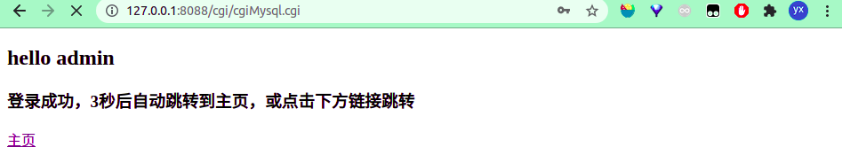
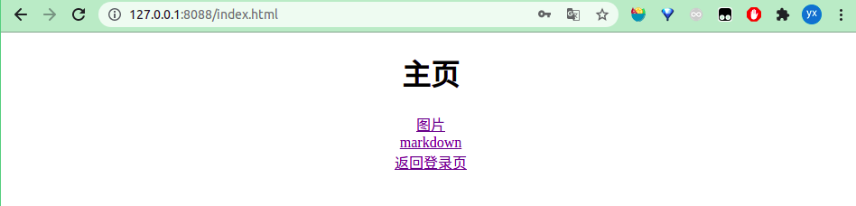

##一、运行说明

1. 进入项目文件
   cd project
2. 修改 http_conn.cpp 文件 14 行对应的网站根目录
3. 安装 mysql 的 C/C++库函数
   sudo apt-get install libmysqlclient-dev
4. 创建 mysql 数据库和数据表

```mysql
//创建数据库
create database webServer;

// 创建user表
USE yourdb;
CREATE TABLE user(
    username char(50) NULL,
    passwd char(50) NULL
)ENGINE=InnoDB;

// 添加数据
INSERT INTO user(username, passwd) VALUES('admin', '123456');
```

5. 修改 /project/root/cgi/cgiMysql.cpp 第 23 行的数据库信息

6. xxx/project $ make server

7. xxx/project $ make cgiMysql

8. xxx/project $ ./server 127.0.0.1 8088

9. 浏览器访问 url 127.0.0.1:8088/log.html

##二、演示

##### 登录页


##### cgiMysql 验证用户



##### 主页



##### 查看图片


## 三、轻量级 Linux web 服务器

使用半同步/半反应堆线程池处理 http 连接
使用边沿触发模式轮询 epoll 内核事件表
采用 Reactor 并发模型
使用主从状态机解析 HTTP 请求报文，支持解析 GET 和 POST 请求
采用 mmap()映射文件、writev()集中写，可以实现对图片的访问
使用 mysql 实现 web 端用户登录验证功能
使用 CGI 处理 POST 请求，生成动态内容
